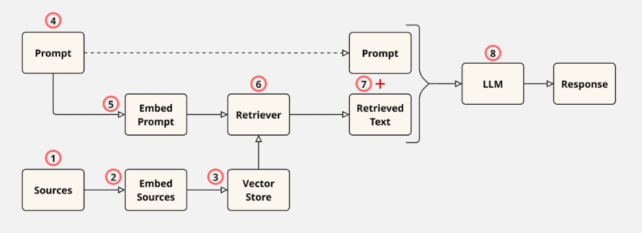

# Introduction to RAG

* RAG (Retrieval-Augmented Generation) is an AI technique that combines relevant information from external data sources with generative models to produce accurate and contextually rich responses.

* Non-RAG systems have a simple Prompt → LLM → Response pipeline. These systems may generate inaccurate, outdated, or fabricated responses.

* RAG aims to augment the prompt with relevant text from an external data store. This enhances response quality by providing the LLM with relevant information, provides up-to-date information to the LLM, and allows the user to verify the sources on which the response is generated.

* Using models with long context lengths instead of RAG requires users to provide the necessary contextual information within the prompt. This approach has limited capacity, may lead to response quality issues when relevant facts are buried within large amounts of irrelevant text, and increases processing time and costs. RAG mitigates these challenges, either partially or fully.

* The following diagram illustrates the RAG process for a basic RAG system:

* Large sources are usually split into smaller chunks prior to or at the embedding step

* Embedding involves tokenization (splitting text into tokens and assigning unique numerical IDs to each token) followed by passing the token IDs through a neural network to produce fixed-length numeric vectors, one for each text chunk.

* Vectors are stored in vector databases that specialize in efficiently processing vector data. Examples of vector databases include ChromaDB, Faiss, and Milvus.

* User's prompts are embedded using the same model as the documents.

* Retrievers retrieve the most similar chunks to the embedded prompt from the vector store. The most similar chunks are found through a similarity search. Methods of determining similarity include cosine similarity, which only compares the angles of vectors, and the dot product, which compares their angles and magnitudes.

