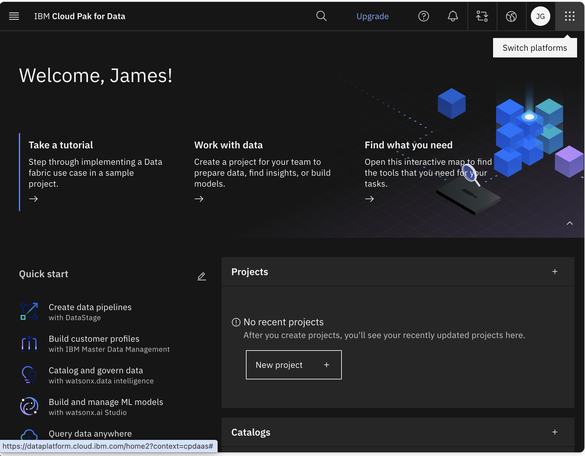
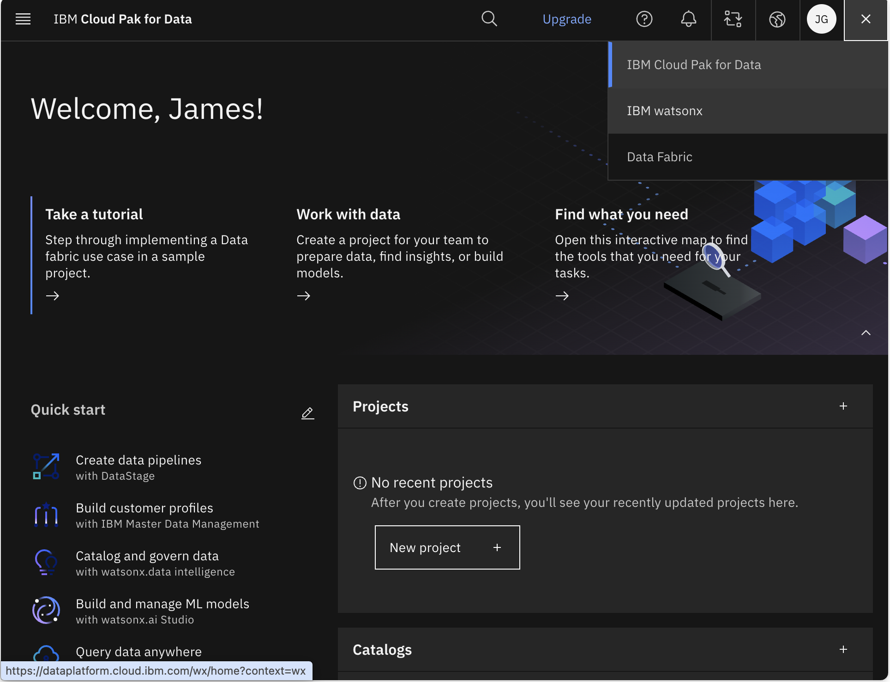
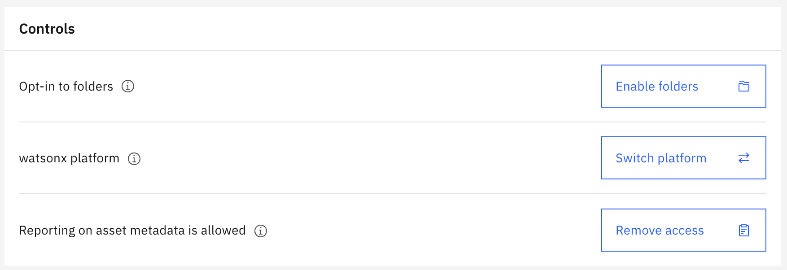
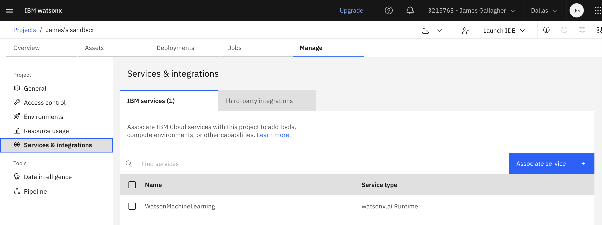

# How to run the RAG notebook

This uses the Python venv system for virtual environments instead of `conda`.

These versions might be overly conservative, but loading these can take some
time so it's hard to determine which versions are needed and which are not.

## Setup the virtual environment

```bash
python3.12 -m venv .venv
source .venv/bin/activate        # Windows: .venv\Scripts\activate
pip install --upgrade pip
```

I tried using python 3.13 (because that was the default for my conda base env)
but pandas 2.? would not build against that (a C++ compiler failure). 

## Load in the notebooks dependencies

```bash
pip install "numpy<2.0.0" "pandas>=2.1.4,<2.2.0" "scipy>=1.12.0,<1.14.0"
pip install torch --index-url https://download.pytorch.org/whl/cpu
pip install ibm-watsonx-ai==0.2.6 langchain==0.1.16 langchain-ibm==0.1.4
pip install transformers==4.41.2 huggingface-hub==0.23.4 sentence-transformers==2.5.1
pip install chromadb    # Chromadb see †
pip install wget==3.2
pip install ipykernel jupyter
```

† ChromaDB issues the following stern message:
```
ERROR: pip's dependency resolver does not currently take into account all the packages that are installed. This behaviour is the source of the following dependency conflicts.
langchain-core 0.1.53 requires packaging<24.0,>=23.2, but you have packaging 26.2 which is incompatible.
```
Claude says to avoid this, go back to ChromaDB <= 0.5 but that seems like it
might break other things in the notebook.

## Then...

Connecting VS Code to it:

Open the folder containing the notebook in VS Code.
Make sure you have the Python and Jupyter extensions installed (VS Code will usually prompt you if they're missing when you open a .ipynb).
Open the .ipynb file, click the kernel picker in the top-right corner ("Select Kernel").
Choose "Select Another Kernel" → "Python Environments" — VS Code auto-detects .venv folders in your workspace and registered conda envs, so your new environment should show up in the list.
Select it. If it wasn't pre-registered with ipykernel, VS Code will offer to install it automatically — say yes.
Run the cells.

Since your environment (from the log) is Python 3.12, matching that locally avoids any wheel-availability surprises. Two paths — pick whichever you prefer:

**Option A: venv**

In a terminal, from your notebook's folder:
```
python3.12 -m venv .venv
source .venv/bin/activate        # Windows: .venv\Scripts\activate
pip install --upgrade pip
```

**Option B: conda**
```
conda create -n coursework python=3.12
conda activate coursework
```

Then, either way, install the packages (use the consolidated cell from before, but as a shell command instead of `!pip install`):
```
pip install "numpy<2.0.0" "pandas>=2.1.4,<2.2.0" "scipy>=1.12.0,<1.14.0"
pip install torch --index-url https://download.pytorch.org/whl/cpu
pip install ibm-watsonx-ai==0.2.6 langchain==0.1.16 langchain-ibm==0.1.4
pip install transformers==4.41.2 huggingface-hub==0.23.4 sentence-transformers==2.5.1
pip install chromadb
pip install wget==3.2
pip install ipykernel jupyter
```

**Connecting VS Code to it:**

1. Open the folder containing the notebook in VS Code.
2. Make sure you have the Python and Jupyter extensions installed (VS Code will usually prompt you if they're missing when you open a .ipynb).
3. Open the .ipynb file, click the kernel picker in the top-right corner ("Select Kernel").
4. Choose "Select Another Kernel" → "Python Environments" — VS Code auto-detects `.venv` folders in your workspace and registered conda envs, so your new environment should show up in the list.
5. Select it. If it wasn't pre-registered with `ipykernel`, VS Code will offer to install it automatically — say yes.
6. Run the cells.

One note: since you already have this working in a hosted Jupyter (IBM Skills
Network, based on the paths in your log), double check any `%pip install` magic
lines still in the notebook — those install into whatever kernel is currently
active, so as long as you've selected your new local venv/conda kernel first,
they'll install there correctly rather than into your system Python.

## Getting a key to use the watson LLM

This is a login-gated page and the docs page didn't render useful content, but this process is well-established and stable enough that I can answer directly.

To use `ibm/granite-4-h-small` (or any watsonx.ai model) outside the Skills Network / lab environment, you need an **IBM Cloud API key**, not a watsonx-specific key. Here's how to get one:

1. **Create/log into an IBM Cloud account** at cloud.ibm.com (a free "Lite" account works for testing, but watsonx.ai inference generally requires a "Pay-As-You-Go" account with billing set up).
2. **Create a watsonx.ai project** if you don't have one: go to
   https://dataplatform.cloud.ibm.com. Here you will create a project, but don't
   make that project in the 'Data Platform' (aka IBM Cloud Pak for Data).
   Instead, click the triple hamburger in the upper right corner and choose 'IBM
   watsonx', choose/create a project, and note its
   **Project ID** (Project → Manage → General) — you'll use this in place of
   `"skills-network"`. 
   
2a. Now, open the project, goto the 'Manage' tab and make sure that the
'Controls/Platform' is set to 'watsonx platform'. Then you need to goto Services
and Integrations and associate WatsonMachineLearning with this project.

2b. Here are some pictures for step 2, even though they are likely to go out of
date:





3. **Generate an API key**: go to IBM Cloud console → Manage → Access (IAM) → API keys (or directly https://cloud.ibm.com/iam/apikeys) → "Create an IBM Cloud API key" → give it a name → copy the key immediately (it's only shown once).
4. **Plug it into your notebook**:

```python
credentials = {
    "url": "https://us-south.ml.cloud.ibm.com",
    "api_key": "YOUR_API_KEY_HERE"
}
project_id = "your-actual-project-id"
```

A couple of things worth knowing before you go further: the free Lite plan has limited or no access to inference for foundation models — you'll likely need to attach a billing account (pay-as-you-go) to your IBM Cloud account to actually call the model. Also, don't hardcode the key in a notebook you'll share or commit — read it from an environment variable or a `.env` file instead, since anyone with that key can rack up usage charges on your account.

If you tell me which project (Skills Network course, your own IBM Cloud account, etc.) this is for, I can be more specific about setup steps.
